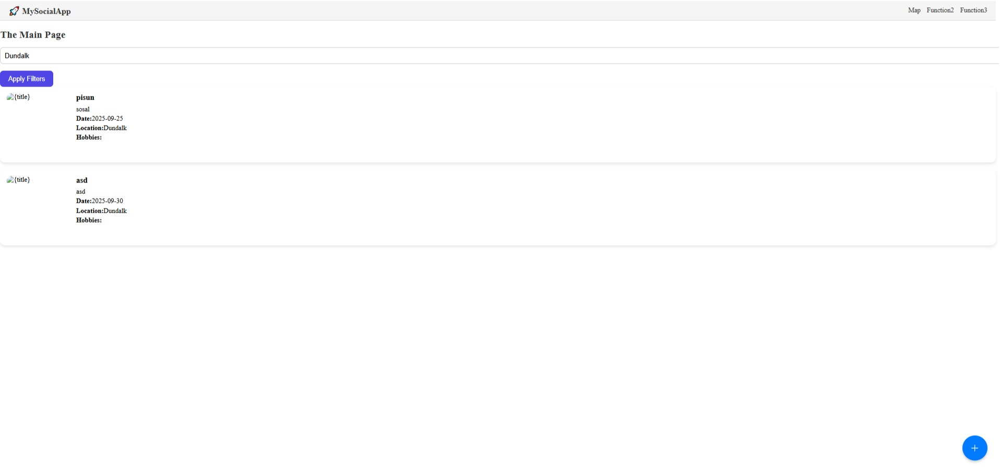
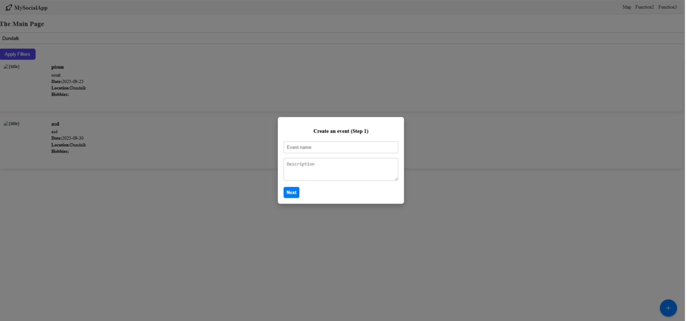

# 🧩 EventHub — Social Event Platform

**EventHub** is a full-stack web application for discovering, creating, and filtering events by hobbies and location.  
Users can create their own events, attach images, select hobbies, and browse official events nearby.


## ⚡️ Key Features & Refactoring Highlights

1.  **Strict Typing:** Implemented comprehensive interfaces for Express `Request`/`Response` objects and Database models.
2.  **Dynamic Filtering:** Advanced SQL query building for events with filters for location, hobbies, and official status.
3.  **Relational Database Schema:** Optimized Many-to-Many relationships for linking users/events with hobbies.
4.  **Security:** Secure password hashing and protected API routes using custom middleware.
5.  **Clean Code:** Migrated to ES Modules (ESM) and centralized database logic in a typed `db.ts` module.
---

## ⚙️ Tech Stack

### 🖥️ Frontend
- **React + TypeScript**
- **Vite** — fast build & hot reload
- **TailwindCSS** — modern styling
- **shadcn/ui + Lucide icons** — prebuilt UI components
- **Framer Motion** — smooth animations
- **React Router** — client-side routing
- **React Hook Form** — form management
- **JWT** — authentication
- **Fetch API** — communication with backend

### 🧩 Backend
- **Node.js + Express** — backend logic
- **Multer** — image uploads (events & avatars)
- **SQLite3** — lightweight database
- **bcrypt** — password hashing
- **jsonwebtoken (JWT)** — user authorization
- **CORS + dotenv** — environment configuration

---

## 🗃️ Database Structure

| Table | Description |
|--------|--------------|
| `users` | User information |
| `hobbies` | List of all hobbies |
| `events` | Main event data |
| `event_hobbies` | Many-to-many relation between events and hobbies |
| `user_hobbies` | User-hobby relations |
| `friends` | Friend requests and connections |

---

## 🚀 Features

✅ User registration and JWT authentication  
✅ Create events with image upload  
✅ Attach multiple hobbies per event  
✅ Filter events by location and hobbies  
✅ Browse official & community events  
✅ Adaptive event cards grid layout  
✅ Component-based architecture (`EventCard`, `Home`, `EventModal`, etc.)  
✅ Smooth page routing (Home, Profile, Friends)

---

## 🧠 Project Architecture

project/
├── backend/
│ ├── server.js # Express entry point
│ ├── db.js # SQLite initialization
│ ├── routes/ # API routes
│ ├── middleware/ # JWT / Multer middlewares
│ └── uploads/ # Stored images
│
└── frontend/
├── src/
│ ├── components/ # UI components (EventCard, Navbar, etc.)
│ ├── pages/ # Pages (Home, Profile, Login, Register)
│ ├── hooks/ # Custom hooks
│ ├── assets/ # Icons, styles
│ └── App.tsx
└── package.json


**Example UI:**
| Home Page | Event Details |
|------------|----------------|
|  |  |

## 📦 Getting Started

### 1. Clone the repository
```bash
git clone [https://github.com/xsliiink/Social-Project.git](https://github.com/xsliiink/Social-Project.git)
cd Social-Project

```

### 2. Install dependencies

```bash
npm install

```

### 3. Run the server
cd client
npm run dev
In the seprate cmd:
cd server
npx tsx server.ts


